# Diagrama final — Genius-x

Mismo diagrama que `harness.excalidraw` / `harness.pdf` / `harness.png`, escrito en mermaid.

- CUELLO DE BOTELLA: el LLM local, que se satura en el pico. Lo aguantan la Cola de Preguntas, las dos copias, el CIRCUIT BREAKER y el CACHE de Respuestas.
- SPOF: Slack API, de un tercero y único canal de avisos. Lo aguantan el CIRCUIT BREAKER y el Email Service.

```mermaid
flowchart LR
  DIEGO(["Diego Ramos - soporte N2"])
  VALERIA(["Valeria Torres - SRE on-call"])
  MARCO(["Marco Salas - incident manager"])
  ADMIN(["Admin de Genius"])

  REG["Registro de Usuarios Service - crea la cuenta y le pone el rol - RF26"]
  USR[("BD Usuarios y roles")]
  LOGIN["Login Service - valida quien es y que rol tiene - RF12"]
  APP["Genius App - Slack y Web"]
  FILTRO["Filtro Service - RF19"]
  CONSULTA["Consulta Service - RF01 RF04 RF23"]
  CACHE[("CACHE de Respuestas - protege al LLM, que es el CUELLO DE BOTELLA - RF04 RF22 RF23")]
  CONTEXTO["Contexto Service - RF03 RF05 RF06 RF25"]
  ESTADO[("BD Estado Actual - atraso maximo 30 s - RF02")]
  HIST[("BD Historial - RF05")]
  CONOC[("BD Base de Conocimiento - RF06")]
  SKILLS[("BD Skills - RF25")]
  COLA["Cola de Preguntas - primero los P1 - RF17"]
  CB1["CIRCUIT BREAKER del LLM - timeout 5 s - RF18"]
  LLM1["LLM local copia 1 - CUELLO DE BOTELLA"]
  LLM2["LLM local copia 2 - CUELLO DE BOTELLA"]
  REV["Revision Service - RF19"]
  ACC["Acciones Service - borrar tablas BLOQUEADO - RF10 RF13"]
  APROB["Aprobacion Service - OK de otro SRE, 30 min - RF11"]
  COPIA[("BD Copia de lectura - RF13")]
  PRUEBAS["Pruebas Service - E2E aparte - RF14"]
  MSG["Mensajes Service - RF09 RF11"]
  CB2["CIRCUIT BREAKER de Slack"]
  SLACK["Slack API - SPOF"]
  EMAIL["Email Service - respaldo del SPOF"]
  INC["Incidentes Service - arma el resumen y lo asigna al on-call - RF07 RF08"]
  BDINC[("BD Incidentes con replica sincrona")]
  CAMBIOS["Cola de Cambios - RF02"]
  SLA["SLA Service - RF07 RF09 RF24"]
  AUD[("BD Auditoria - RF15")]
  APREND["Aprendizaje Service - RF16"]
  INDEX["Indexar Job cada 15 min - RF06"]
  PD["Pruebas Diarias Job - RF20"]
  MON["Monitoreo Service - RF21"]
  REP["Reportes Service - Tablero SLA y Panel de salud - RF21 RF24"]

  ADMIN -->|"crea la cuenta"| REG
  REG -->|"guarda el rol"| USR
  DIEGO -->|"pregunta o escala"| APP
  VALERIA -->|"pregunta, query o escritura"| APP
  MARCO -->|"mira el tablero"| APP
  APP -->|"quien es"| LOGIN
  LOGIN --> USR
  LOGIN -->|"rol OK"| FILTRO
  FILTRO -->|"pregunta OK"| CONSULTA
  CONSULTA -->|"ya existe"| CACHE
  CACHE -->|"misma respuesta"| APP
  CONSULTA -->|"no existe"| CONTEXTO
  CONSULTA -->|"sin LLM: estado + respuesta guardada"| ESTADO
  CONTEXTO --> ESTADO
  CONTEXTO --> HIST
  CONTEXTO --> CONOC
  CONTEXTO --> SKILLS
  CONTEXTO -->|"pregunta + contexto"| COLA
  COLA --> CB1
  CB1 --> LLM1
  CB1 -->|"retry"| LLM2
  LLM1 --> REV
  LLM2 --> REV
  REV -->|"es texto: la respuesta vuelve al ingeniero"| APP
  APP -->|"respuesta con fuente y fecha"| DIEGO
  REV -->|"es una accion"| ACC
  ACC -->|"lectura"| COPIA
  ACC -->|"E2E"| PRUEBAS
  ACC -->|"escritura: necesita aprobacion"| APROB
  ACC -->|"escalar o comentar"| INC
  APROB -->|"pide OK"| MSG
  APROB -->|"aprobado: ejecuta"| ACC
  MSG --> CB2
  CB2 --> SLACK
  MSG -->|"si Slack falla"| EMAIL
  ACC --> AUD
  APP -->|"/incident id, sin LLM - RF18"| INC
  INC -->|"resumen"| HIST
  INC -->|"asigna al on-call"| MSG
  SLACK -->|"le llega el escalamiento"| VALERIA
  INC --> BDINC
  INC -->|"creado o cerrado"| CAMBIOS
  CAMBIOS -->|"en 30 s"| ESTADO
  CAMBIOS -->|"borra lo guardado"| CACHE
  CAMBIOS -->|"plazos 1d y 3d"| SLA
  CAMBIOS --> AUD
  SLA -->|"alertas 50/80/100 %"| MSG
  SLA --> REP
  MON --> REP
  REP -->|"tablero y semaforo"| MARCO
  APP -->|"feedback"| APREND
  APREND --> CACHE
  INDEX --> CONOC
  INDEX --> SKILLS
  PD --> LLM1
  MON --> LLM1
  MON --> SLACK
```

## Caminos completos

- Diego pregunta: DIEGO, APP, LOGIN, FILTRO, CONSULTA, CACHE o CONTEXTO, COLA, CB1, LLM1, REV, APP, DIEGO. RF01 a RF06, RF17, RF19, RF23.
- Diego escala: hasta ACC, INC arma el resumen y lo asigna al on-call, BDINC, CAMBIOS, SLA, MSG, CB2, SLACK, VALERIA. RF07, RF08, RF09.
- Valeria corre una query o una escritura: ACC, COPIA para lectura; para escritura APROB, MSG y el OK de otro SRE. RF10, RF11, RF13, RF14.
- Marco mira los plazos: MARCO, APP, LOGIN, REP. RF21, RF24.
- El LLM no responde: CONSULTA contesta con ESTADO y CACHE, y `/incident id` va directo a INC. RF18.
