# Diagrama final — Genius-x, harness del LLM de incidentes

Mismo diagrama que `harness.excalidraw` / `harness.pdf` / `harness.png`, escrito en mermaid para poder leerlo como texto.

Usuarios del diagrama: Diego Ramos (ingeniero de soporte N2), Valeria Torres (SRE on-call) y Marco Salas (incident manager), más el admin que crea las cuentas.

Piezas de reliability marcadas en el diagrama:

- CUELLO DE BOTELLA: el LLM local. Se satura la primera semana del mes. Lo aguantan la Cola de Preguntas, dos copias del LLM, el CIRCUIT BREAKER y el CACHE de Respuestas.
- SPOF: Slack API, que es de un tercero y es el único canal de avisos. Lo aguantan el CIRCUIT BREAKER y el Email Service de respaldo.
- SPOF que ya no existe: la BD de incidentes tiene réplica síncrona con cambio automático, y cada service tiene dos copias detrás de un balanceador.

```mermaid
flowchart LR
  ADMIN(["Admin de Genius"])
  DIEGO(["Diego Ramos - ingeniero de soporte N2"])
  VALERIA(["Valeria Torres - SRE on-call"])
  MARCO(["Marco Salas - incident manager"])

  REG["Registro de Usuarios Service - crea la cuenta y le pone el rol - RF26"]
  USR[("BD Usuarios y roles")]
  LOGIN["Login Service - valida quien es y que rol tiene - RF12"]
  APP["Genius App - Slack y Web"]
  FILTRO["Filtro Service - saca instrucciones escondidas y datos sensibles - RF19"]
  CONSULTA["Consulta Service - busca si la pregunta ya tiene respuesta - RF01 RF04 RF23"]
  CACHE[("CACHE de Respuestas - respuestas aprobadas y ya dadas - protege al LLM que es el CUELLO DE BOTELLA - RF04 RF22 RF23")]
  CONTEXTO["Contexto Service - junta estado, historial, conocimiento y skill - RF03 RF05 RF06 RF25"]
  ESTADO[("BD Estado Actual - atraso maximo 30 s - RF02")]
  HIST[("BD Historial del incidente - RF05")]
  CONOC[("BD Base de Conocimiento - runbooks y postmortems con version y fecha - RF06")]
  SKILLS[("BD Skills - guias paso a paso por tipo de tarea - RF25")]
  COLA["Cola de Preguntas - primero P1 y customer escalations - RF17"]
  CB1["CIRCUIT BREAKER del LLM - timeout 5 s, retry en la copia 2, si abre se responde sin LLM - RF18"]
  LLM1["LLM local copia 1 - CUELLO DE BOTELLA, se satura en el pico"]
  LLM2["LLM local copia 2 - segunda copia del CUELLO DE BOTELLA"]
  REV["Revision Service - revisa la respuesta antes de ejecutar nada - RF19"]
  ACC["Acciones Service - lista de acciones permitidas, borrar tablas esta BLOQUEADO - RF10 RF13"]
  APROB["Aprobacion Service - pide OK a otro SRE, expira en 30 min - RF11"]
  COPIA[("BD Copia de lectura - solo SELECT, 1000 filas, timeout 10 s - RF13")]
  PRUEBAS["Pruebas Service - E2E en ambiente aparte - RF14"]
  MSG["Mensajes Service - avisos y pedidos de aprobacion - RF09 RF11"]
  CB2["CIRCUIT BREAKER de Slack - retry y si Slack no responde sale por correo"]
  SLACK["Slack API - SPOF, es de un tercero y es el unico canal"]
  EMAIL["Email Service - respaldo del SPOF de Slack"]
  INC["Incidentes Service - crea, clasifica, escala y cierra incidentes - RF07 RF08"]
  BDINC[("BD Incidentes con replica sincrona - RPO 0")]
  CAMBIOS["Cola de Cambios - avisa a las demas piezas cuando cambia un incidente - RF02"]
  SLA["SLA Service - plazos 1 dia y 3 dias, alertas 50/80/100 % - RF07 RF09 RF24"]
  AUD[("BD Auditoria - solo se agrega, no se borra - RF15")]
  APREND["Aprendizaje Service - feedback validado por una persona - RF16"]
  INDEX["Indexar Job cada 15 min - RF06"]
  PD["Pruebas Diarias Job - si acierta menos de 95 % no se despliega - RF20"]
  MON["Monitoreo Service - Availability, Reliability, P95, health de cada pieza - RF21"]
  REP["Reportes Service - Tablero SLA y Panel de salud con semaforo - RF21 RF24"]

  ADMIN -->|"crea la cuenta y le pone el rol"| REG
  REG -->|"guarda usuario y rol"| USR
  DIEGO -->|"pregunta o escala"| APP
  VALERIA -->|"pregunta, query o escritura"| APP
  MARCO -->|"consulta el tablero"| APP
  APP -->|"quien es"| LOGIN
  LOGIN -->|"valida contra usuarios y roles"| USR
  LOGIN -->|"rol OK"| FILTRO
  FILTRO -->|"pregunta OK"| CONSULTA
  CONSULTA -->|"ya existe la respuesta"| CACHE
  CACHE -->|"misma pregunta, misma respuesta"| APP
  CONSULTA -->|"no existe"| CONTEXTO
  CONSULTA -->|"si el LLM no responde: estado + respuesta guardada"| ESTADO
  CONTEXTO -->|"estado real del incidente"| ESTADO
  CONTEXTO -->|"lo que ya se hizo"| HIST
  CONTEXTO -->|"runbooks con fecha y version"| CONOC
  CONTEXTO -->|"guia de la tarea"| SKILLS
  CONTEXTO -->|"pregunta mas contexto"| COLA
  COLA --> CB1
  CB1 --> LLM1
  CB1 -->|"si la copia 1 no responde"| LLM2
  LLM1 -->|"respuesta"| REV
  LLM2 -->|"respuesta"| REV
  REV -->|"es texto: la respuesta vuelve al ingeniero con fuente y fecha"| APP
  APP -->|"respuesta a Diego, Valeria o Marco"| DIEGO
  REV -->|"es una accion"| ACC
  ACC -->|"lectura"| COPIA
  ACC -->|"pruebas E2E"| PRUEBAS
  ACC -->|"escritura: necesita aprobacion"| APROB
  ACC -->|"bajo riesgo: escalar o comentar, sin aprobacion"| INC
  APROB -->|"pide OK a otro SRE"| MSG
  MSG --> CB2
  CB2 --> SLACK
  MSG -->|"si Slack falla"| EMAIL
  APROB -->|"aprobado: ejecuta"| ACC
  ACC -->|"todo queda registrado"| AUD
  APP -->|"comando /incident id, camino directo sin LLM - RF18"| INC
  INC -->|"guarda"| BDINC
  INC -->|"creado, cambiado o cerrado"| CAMBIOS
  CAMBIOS -->|"actualiza el estado en 30 s"| ESTADO
  CAMBIOS -->|"borra la respuesta guardada de ese incidente"| CACHE
  CAMBIOS -->|"plazos 1 dia y 3 dias"| SLA
  CAMBIOS -->|"registra el cambio"| AUD
  SLA -->|"alertas 50/80/100 %"| MSG
  SLA -->|"plazos abiertos"| REP
  MON -->|"semaforo sano, degradado o no confiar"| REP
  REP -->|"tablero de SLA y panel de salud"| MARCO
  APP -->|"feedback: correcta o incorrecta"| APREND
  APREND -->|"correccion validada"| CACHE
  INDEX -->|"lo nuevo entra, lo viejo queda marcado"| CONOC
  INDEX --> SKILLS
  PD -->|"preguntas comunes contra respuesta esperada"| LLM1
  MON -->|"health de cada pieza"| LLM1
  MON -->|"health de cada pieza"| SLACK
```

## Caminos completos

- Diego pregunta por un incidente: Diego -> Genius App -> Login Service -> Filtro Service -> Consulta Service -> CACHE de Respuestas, y si no está, Contexto Service -> Cola de Preguntas -> CIRCUIT BREAKER -> LLM local -> Revision Service -> Genius App -> Diego. Cubre RF01, RF02, RF03, RF04, RF05, RF17, RF19, RF23.
- Diego escala un incidente: la misma cadena hasta Revision Service -> Acciones Service -> Incidentes Service -> BD Incidentes -> Cola de Cambios -> SLA Service -> Mensajes Service -> CIRCUIT BREAKER -> Slack API, y si Slack no responde, Email Service. Cubre RF07, RF08, RF09.
- Valeria corre una query: hasta Acciones Service -> BD Copia de lectura, y la respuesta vuelve por Revision Service y Genius App. Una escritura pasa antes por Aprobacion Service y el OK de otro SRE. Cubre RF10, RF11, RF13, RF14.
- Marco mira los plazos: Marco -> Genius App -> Login Service -> Reportes Service -> Tablero SLA y Panel de salud. Cubre RF21, RF24.
- Cuando el LLM no responde: Consulta Service contesta con el estado actual y la respuesta guardada, marcado "sin LLM", y `/incident <id>` va directo a Incidentes Service. Cubre RF18.
