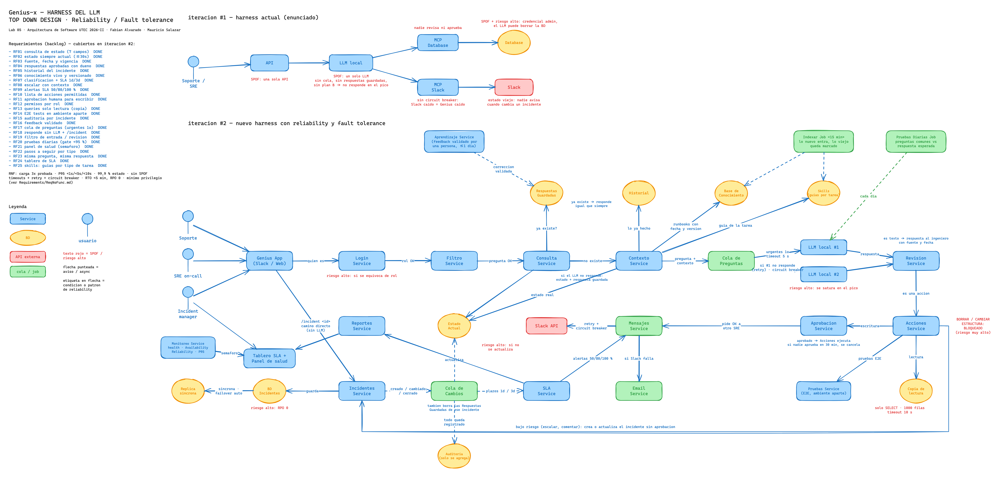

# Lab 05 – Genius-x

Integrantes: Fabian Alvarado Vargas, Mauricio Salazar Hillenbrand
Curso: Arquitectura de Software, UTEC 2026-II. Caso de estudio #5, tema reliability y fault tolerance.

## El problema

Genius es el software que usa la compañía para manejar sus incidentes diarios: customer escalations (vienen del cliente, impacto directo en el negocio), engineering escalations (los reporta ingeniería) y support escalations (vienen del cliente pero ya pasaron por soporte). Como el detalle de los incidentes no puede ser público, data science puso un LLM local y le dio una API al área de incidentes para consultar y ejecutar acciones (queries a la base, E2E tests). Hoy el LLM solo tiene MCP a la base de datos y a Slack, nada más alrededor.

Con eso pasaron estas cosas:

- Un ingeniero de soporte dio una instrucción para un escalamiento y el LLM borró la base de datos.
- El LLM no aprende, responde con data vieja o equivocada.
- La primera semana de cada mes (el día con más incidentes) el LLM no responde o responde mal.
- A la misma pregunta responde distinto, y las preguntas comunes cambian de respuesta cada día.
- Soporte se queja de que Genius dice que un incidente está abierto cuando se cerró hace horas.

El enunciado pide: 10 000 incidentes por semana o más en picos, 50 a 100 ingenieros, SLA de 1 día para customer escalations y 3 días para engineering, disponibilidad y tolerancia a fallos, y latencia mínima para decisiones críticas. El entregable es el diagrama de arquitectura del nuevo harness, identificando los SPOF y los componentes de riesgo alto.

## Usuarios

- Ingenieros de soporte: procesan los customer escalations y le responden al cliente.
- SREs on-call: atienden los engineering escalations y los P1, ejecutan queries y tests desde Genius.
- Incident manager: responde por los SLA y por lo que se le dice al cliente.
- Data science es dueño del LLM, y la compañía y sus clientes quieren los incidentes resueltos a tiempo y sin que los datos salgan de la red.

Los usuarios modelo están en `Personas/`: [Diego](Personas/Diego.md) (soporte), [Valeria](Personas/Valeria.md) (SRE) y [Marco](Personas/Marco.md) (incident manager).

## Requerimientos

- [Funcionales](Requirements/ReqFunc.md) (RF01 a RF25)
- [No funcionales](Requirements/ReqNoFunc.md) (RNF01 a RNF13)

## Harness

Fuimos problema por problema y para cada uno pusimos una pieza alrededor del LLM, cada una con una sola responsabilidad. Está explicado en [HARNESS.md](HARNESS.md): qué falla hoy, cómo lo pensamos siguiendo el camino de una pregunta, de una acción y de un cambio de incidente, la lista de piezas, los SPOF que se eliminan y las piezas de riesgo alto.

Los pasos de R.E.D.A.L.E. están en `REDALE/`: [requerimientos](REDALE/1-Requerimientos.md), [estimación](REDALE/2-Estimar.md) y [diseño del servicio](REDALE/3-Disenar-el-servicio.md).

## Diagrama



Hecho en Excalidraw. La iteración #1 es el harness actual con los SPOF marcados en rojo, la iteración #2 es el nuevo. Archivos: [harness.pdf](Diagramas/harness.pdf), [harness.excalidraw](Diagramas/harness.excalidraw) (para editarlo en excalidraw.com), [harness.png](Diagramas/harness.png).

## Happy paths

Uno por persona, seguidos sobre el diagrama con el camino resaltado y los pasos numerados. Los pasos están en [HAPPY-PATH.md](HAPPY-PATH.md).

- [Happy path 1](Diagramas/harness-hp1.pdf): soporte responde al cliente y escala (Diego).
- [Happy path 2](Diagramas/harness-hp2.pdf): el SRE ejecuta una query y una escritura aprobada (Valeria).
- [Happy path 3](Diagramas/harness-hp3.pdf): se cierra un incidente y todos ven lo mismo (Marco).
- [Camino de falla](Diagramas/harness-sin-llm.pdf): el LLM no responde.

## Eval

Corrimos el eval con Claude como en los labs anteriores: un agente por persona (`Agents/`) evalúa los requerimientos contra sus necesidades y pain points, y un juez ([Eval-Spec](Agents/Spec/Eval-Spec.md)) audita y da el puntaje.

- Iteración 1: 7,1/10, FAILED. Faltaban cosas como que soporte pudiera escalar sin aprobación, un tablero de SLA y garantizar la misma respuesta fuera de las preguntas frecuentes.
- Iteración 2: 9,0/10, PASSED.

Todo está en [REPORTE.md](REPORTE.md). El prompt que usamos:

```
Actúa como el agente definido en Agents/[Persona]-Agent.md. Encarna a esa persona
(Personas/[Persona].md): necesidades y pain points. No eres un asistente.

Lee Requirements/ReqFunc.md y Requirements/ReqNoFunc.md.

1. Para cada necesidad (N) y pain point (P) tuyo indica qué requerimiento(s) lo cubren
   (ID exacto) y si la cobertura es total (5), parcial (1) o nula (0). Ante la duda, el menor.
2. Señala lo que NINGÚN requerimiento cubre y qué RF/RNF habría que crear o cambiar.
3. Veredicto en primera persona: ¿Genius te sirve en tu día a día? ¿Qué te falta?

Luego un cuarto agente actúa como Agents/Spec/Eval-Spec.md: audita las tres evaluaciones
contra el texto de los requerimientos, calcula el score por persona y el promedio, y da
PASSED o FAILED.
```

## Estructura

```
lab05/
├── README.md
├── HARNESS.md
├── HAPPY-PATH.md
├── REPORTE.md
├── Personas/        Diego.md, Valeria.md, Marco.md
├── Requirements/    ReqFunc.md, ReqNoFunc.md
├── Agents/          un agente por persona y Spec/Eval-Spec.md
├── REDALE/          1-Requerimientos, 2-Estimar, 3-Disenar-el-servicio
├── Diagramas/       harness y harness-hp1/hp2/hp3/sin-llm (.excalidraw, .pdf, .png, .svg)
└── tools/           scripts para generar y exportar el diagrama
```
